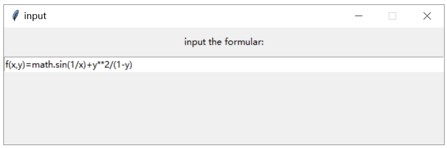
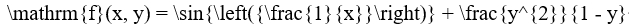
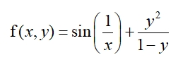

# 基于latexify的word公式自动转换输入

最近刷知乎看到latexify这个库的介绍，结合之前word输入公式的麻烦经历，突发奇想有了这个小项目，采用latexify库将输入的公式转换为latex公式，然后自动插入word中，实现简单的公式输入。

注：刚开始时，本来是计划使用word自带的公式编辑器进行的，但是后来发现很多latex格式在这个自带的编辑器中有识别问题，所以最终采用的是结合mathtype实现的方式。

最终实现的步骤如下：

## 1. 程序后台运行并使用keyboard库监控

> ```python
> keyboard.add_hotkey('ctrl+`',inputFormular)
> keyboard.wait()
> ```

程序使用后台运行，运行之后使用keyboard库监控键盘，当检测到特定热键（如'ctrl+`'）使用时，开始调用后续程序——函数inputFormular

## 2. 接收公式输入

inputFormular会首先调用tkinter库生成弹出窗口输入，如下图



公式的语法与普通python语法一致，以回车结束，程序将输入框内容提取到后续处理

## 3. 公式转换

这里调用latexify库将上述得到的python公式转换为latex公式，如上面的例子会转换为：



## 4. latex公式转入粘贴板

有了上述公式，其实我们就可以手动的把它复制黏贴到mathtype中就行了，但为了更加的偷懒，这里采用pyperclip库，将上述公式复制到剪切板中，为后续自动插入公式做准备。

```python
pyperclip.copy(formular)
```

## 5. 自动在word中插入公式

这里调用pyautogui库，使用word及windows系统提供的热键，实现了打开mathtype输入框、使用'ctrl+v'将上述latex公式输入mathtype以及使用'alt+f4'关闭mathtype，从而实现了在word中自动插入公式的功能，最终在效果如下：



## 6. 其他一些说明

上述步骤是这个小程序实现的基本原理，为了程序能够正常运行，还有一些其他处理如下：

- 为了保证公式能够正确的插入word文档，在调用相关程序之前，需要先将word文档前置并设定为当前活动窗口，相关程序如下：

  ```python
  def prepose_window(hwnd, wildcard):
      pythoncom.CoInitialize()
      if re.match(wildcard, str(win32gui.GetWindowText(hwnd))) is not None:
          win32gui.BringWindowToTop(hwnd)
          shell = win32com.client.Dispatch("WScript.Shell")
          shell.SendKeys('%')
          win32gui.SetForegroundWindow(hwnd)#设置为当前活动窗口
  ```

- 由于latexify库的限制，其只能输入类似$$ f(x,y)=sin(\frac{1}{x})+\frac{y^2}{1-y}$$的公式，为了能够输入类似$$f=sin(\frac{1}{x})+\frac{y^2}{1-y}$$以及$$sin(\frac{1}{x})+\frac{y^2}{1-y}$$这样的公式，程序还会根据步骤2得到的公式形式，分别进行处理，使得程序能够处理后面两种形式的公式。

- 修改了latexify库中的一个小问题，原先在遇到$$x-(y+z)$$ 时，latexify错误的将结果输出为$$x-y+z$$，这是由于latexify中_wrap(child)函数的问题，针对这一问题进行了修改，见下方程序:

  ```python
      def _wrap(child):
        latex = _unwrap(child)
        if isinstance(child, ast.BinOp):
          cp = priority[type(child.op)] if type(child.op) in priority else 100
          pp = priority[type(node.op)] if type(node.op) in priority else 100
          '''
          #原程序
          if cp < pp:
            return '(' + latex + ')'
          '''
          #修改
          if cp <= pp and child.op != node.op:
            return '(' + latex + ')'
        return latex
  ```

## 总结

和之前一样，这个小程序只是一时兴趣的练手作，实际上如果会latex或者unicode格式的话，直接使用word自带公式编辑器或者mathtype也很简单，但是如果不会这两种的话，这个小程序也许能帮你省下一点时间。

程序运行方式：运行foreground.py文件后，在需要输入公式的word文件中按'ctrl+`'运行

项目Github地址：https://github.com/SanLiWuXun/formular-auto-input-with-python-in-word